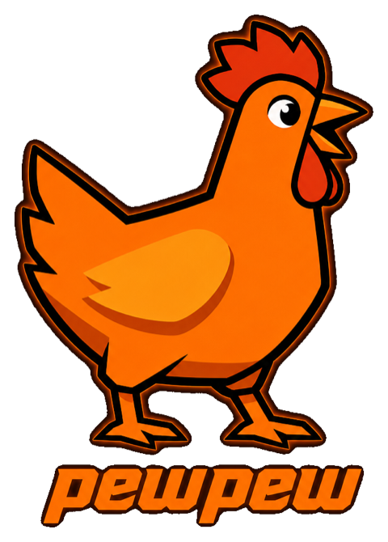

<p align="center">
  
</p>

# pewpew

Finds the gunshots in a CS2 clip and swaps their sound for a meme sound. Runs entirely in the browser.

**[pewpew.baby](https://pewpew.baby)**

## What it does

1. **Upload a clip.** mp4, webm or mov, up to 60 s and 15 MB. The expected input is a vertical short (720×1280).
2. **Shots are found.** The clip is analysed on your device. Nothing is uploaded to a server — the site has no backend at all.
3. **Check the marks.** Add, delete or move shots on the timeline. Detection is a first draft, not a verdict.
4. **Pick a sound.** One of 16 built-in meme sounds, your own file (mp3, wav, ogg, m4a, up to 5 s) or a recording from the microphone.
5. **Export.** An mp4 with the replaced sound and a short outro, encoded in the browser.

Interface languages: English and Russian.

## How detection works

The input is gameplay someone else recorded, cropped to 9:16 and mixed with music and commentary. Three signals are available, and none of them is enough on its own.

```
video ─┬─ audio ── ShotNet ─────────────── candidates ──┐
       │                                                 ├─ ladder per clip ─ one clip-wide shift to the audio ─ marks
       └─ frames ─┬─ ammo counter (HUD) ────────────────┤
                  └─ muzzle flash (YOLOv8, ONNX) ───────┘
```

- **Audio — ShotNet.** A small 1D convolutional network over a mel spectrogram that scores every audio frame for "a shot is here". It hears almost everything and is wrong most of the time: on its own at threshold 0.5 it has 88.1% recall at 20.1% precision. So it proposes candidates and does not decide.
- **Ammo counter.** When the HUD is in frame, the counter drops by exactly one on each of *your* shots and ignores everyone else's. Digits are read with a nearest-neighbour classifier over glyph prototypes, not a network: ten symbols, one font. Audio candidates tell the real counter apart from a timer or scoreboard. Shorts crop the bottom row of the HUD off, so the counter is visible in only 19 of 45 corpus clips. That is a limit of the input, not of the reader.
- **Muzzle flash.** A YOLOv8 model (`public/models/flashNet416.onnx`) runs on every frame in a Web Worker: WebGPU, with a wasm fallback. Classes cover muzzle flash and tracers, both scoped and unscoped. An "own weapon" anchor, picked by flash *size* rather than frequency, filters out other players' fire.
- **Fusion.** Frames are decoded once, and both video readers use them. For each clip the counter wins if it is found. Otherwise the flash is used. The counter is dropped when confident flashes have no decrement next to them. The final marks then get one clip-wide shift to where the shot is *heard*, since we replace the sound, not the picture. The earlier motion-based stage (`domain/detection/motion`) is still in the code but no longer called.

**Where it stands.** The shipped path (ammo counter where it is readable, muzzle flash otherwise, then one clip-wide shift towards the audio) was last measured on 15 September 2026 on the full corpus (50 clips, 1006 own shots): **event-metric F1 82.7** (precision 91.0, recall 75.8; 141 of 186 events found, 14 extra), `eval/eventScore.ts` on marks from `/eval/speed.html`. Events are what a listener hears (see Evaluation below), so this number is not comparable with per-shot ones. The last per-shot measurement (±50 ms, micro-averaged) is F1 60.5 (precision 68.8, recall 54.0) from 9 September; it predates the 14 September fix of a one-frame clock offset in the marks and has not been re-run since. Both numbers are optimistic: the flash model was trained on frames from the same clips. For the flash model the size of that inflation has not been measured; for the earlier motion model it was about 4 F1 points.

**Known limits.**

- **Suppressors and some scopes.** A suppressed weapon barely flashes, and some scopes hide the flash. With the first flash model (31 August) recall was 23% on `m4a1s` and 0% on `g3sg1`, against 100% on `ak47` and `glock`. The retrained model (1 September) learned scoped fire (`aug` 4% → 85%), but `g3sg1` stayed at 0%. On the five clips with neither a readable counter nor a usable flash the product finds 5 of 22 events.
- **Single shots with no video cue.** On clips like these, audio has the recall but no way to filter the noise: 43 real single shots against 1034 false candidates. The measurement is in `eval/README.md`.
- **Flashbangs.** A flashbang blinds both sensors, and it also deafens the player in-game, so those windows are excluded from scoring.
- **Landscape video is untested.** The whole corpus is vertical.

## Evaluation

- **Labeled corpus.** Each clip has a label file in `labels/`: shot times, own or enemy, weapon, a "hard" flag. Labels are made with the built-in labeler (`/labeler.html` in dev). The clips themselves are copyrighted and are not in the repository.
- **Event metric, calibrated by ear.** Shots are grouped into events at 0.4 s gaps. Fast bursts are judged as one continuous sound, and slow fire by the number of pops. A constant per-clip offset is not counted as an error, because the user corrects it with the trim slider. Extras in silence always count. The rules come from by-ear verdicts on all 33 clips with bursts. The previous metric credited 47% of events on clips the user judged "good"; the current one credits 98.5% (`eval/eventScore.ts`).
- **The ear outranks the metric.** Anything that changes what you hear or see is signed off by a person. This has caught the metric wrong more than once. Filling gaps along the fire-rate grid (`fillRhythm.ts`) looked like a big win on the numbers. In practice it turned two pistol shots into a burst of eight, and it was removed after a listen.
- **Negative results are documented.** Closed directions stay recorded with their numbers so nobody runs them again: timbre self-similarity, fallback to audio marks, collapsing neighbouring marks, frame skipping and others. See `eval/README.md` and `docs/RESEARCH-journal.md`.
- **Two tiers.** Synthetic tests run anywhere in under a second (`pnpm test`). Real-clip evaluation runs only locally, on your own copies of the clips.

Research notes in `docs/` are being translated; some are still in Russian.

## Repository layout

```
src/        the web app (React + TypeScript); everything runs in the browser
eval/       detection metric, clip corpus runners, browser checks; most Vitest suites
python/     research and model training; reference implementations ported to TS
labels/     per-clip shot labels (JSON) — the ground truth for eval/
fixtures/   eval inputs; only fixtures/models/ is tracked, __* folders are local scratch
public/     static assets: ONNX/JSON models, replacement sounds, outro, localized images
scripts/    build and dev tooling: dist compression, dev-server middlewares, generators
docs/       handoffs, research journal, design mockups, ADRs (docs/adr/)
.claude/    Claude Code agents (one per work zone) and the project's own skill
```

`.claude/skills/` contains only the project's own `video-analysis-optimizer`. Third-party
skills used during development are not part of the repository (ADR 0013).

## Architecture

`src/` uses a feature-based layout with five layers; dependencies point only downward:

```
app → pages → features → domain → shared
```

| layer | contents | may import |
|---|---|---|
| `src/app/` | entry point, `BrowserRouter`, routes, site shell | everything |
| `src/pages/` | static route pages (How it works, FAQ, 404/500) | features, domain, shared |
| `src/features/` | `wizard/` (incl. `export/`), `feedback/`, `labeler/` | domain, shared — never another feature |
| `src/domain/` | product logic without React or the store | shared/lib, other domain modules |
| `src/shared/` | `ui/`, `lib/`, `store/`, `i18n/`, `config/`, `feedback/` | shared only |

A feature is imported from outside only through its `index.ts`. Code needed by two features
moves down to `domain` or `shared`. The rules live in `.dependency-cruiser.cjs` and are checked
by `pnpm check:deps`, which is part of `pnpm build` — a violating import fails the build.

**Domain.** `src/domain/detection/` — shot detection: `flash/` (muzzle-flash ONNX model in a
worker), `ammo/` (ammo-counter reader), `motion/`, `shotNet/` (audio model), onset detection
and fusion. `src/domain/audio/` — decoding, splicing, WAV encoding, the sound library.
`src/domain/video/` — frame metrics and screen regions.

**State.** Two zustand stores, each assembled from slices:

- `src/shared/store/siteStore.ts` — site shell (menu, feedback dialog), usable on any page.
- `src/features/wizard/store/wizardStore.ts` — the wizard: project, detection, shots,
  replacement, export, steps.

Keeping them apart means the FAQ page doesn't pull in wizard state.

**Routing.** `src/app/App.tsx`: `/` is the wizard, plus `/how-it-works`, `/faq`, `/500` and a
catch-all 404, all inside one shell with header, footer and the feedback dialog. The wizard's
steps are not routes: the current step is a state machine in
`src/features/wizard/model/navigation.ts`, progress is kept in `stepsSlice`. The labeler is a separate dev-only entry,
`labeler.html`.

**Decisions** are recorded in `docs/adr/`: [0001](docs/adr/0001-feature-based-layout.md)
(the layout), [0002](docs/adr/0002-import-rules-dependency-cruiser.md) (enforcement),
0003–0009 (the migration), 0010–0013 (later decisions).

## Getting started

Requires Node 22.22+ or 24+ (`engines` in `package.json`; odd majors are not supported by the dependency checker) and pnpm 10, pinned in `package.json` and enabled through corepack. Installing on another Node version fails on purpose (`engineStrict`).

```bash
corepack enable
pnpm install
pnpm dev          # http://localhost:5173
```

| command | what it does |
|---|---|
| `pnpm dev` | dev server; the labeler is at `/labeler.html` |
| `pnpm build` | `tsc -b`, the layer check (`check:deps`), Vite build, precompressed assets in `dist/` |
| `pnpm test` | Vitest: unit and synthetic tests; the real-clip suite is skipped on a fresh checkout |
| `pnpm check:deps` | enforces the `app → pages → features → domain → shared` import direction |
| `pnpm lint` | oxlint |
| `pnpm eval` | per-shot evaluation on local clips (see below) |

**About `pnpm eval`.** It will not produce numbers on a fresh checkout. It needs:

- the clips in `examples/` (gitignored, copyrighted);
- decoded audio in `examples/.cache/<slug>.wav`, written by the labeler, since Node has no WebCodecs and no AAC decoder;
- for the video stage, caches in `eval/.cache/` that are computed in the browser (`/eval/*.html` pages under `pnpm dev`). Clips without a cache are scored on audio only, and the run says so.

It measures the earlier audio + motion scheme and serves as a regression guard, not a quality claim. Its numbers are optimistic by about 4 F1 points, because the motion model is trained on all clips with no held-out set. Measurements of the shipped flash path are described in `docs/HANDOFF-flash.md`.

**Environment.** Copy `.env.example` to `.env`. Both variables are optional:

| variable | purpose | when empty |
|---|---|---|
| `VITE_WEB3FORMS_KEY` | feedback form (Web3Forms) | the form reports that the message did not go through |
| `VITE_GA_ID` | Google Analytics | the tracker is not loaded |

`VITE_*` values are inlined into the bundle at build time, so they are public by design. Never put a secret there.

## Built with a team of Claude Code agents

The project was built by one person working with Claude Code, organised like a small team rather than a single chat. The setup is part of the repository.

- **Seven zones, seven agents.** Each has a written brief in `.claude/agents/`: what it owns, what it must not touch, what to read first, and how to hand off.

  | agent | owns |
  |---|---|
  | `architect` | module structure, store slices, routes; moves files, writes ADRs |
  | `detection` | audio, flash, motion, ammo counter, fusion, model training, Python |
  | `eval` | the metric, labels, the clip corpus, the labeler |
  | `tests` | DOM-free unit tests and build integrity |
  | `ui` | components, styles, pages, the wizard, i18n, accessibility |
  | `utils` | audio splicing, video export, shared utilities, build scripts |
  | `design` | mockups, brand graphics, tokens, screen copy |

- **A main session coordinates.** It splits cross-zone tasks, hands each part to its owner and merges the results. This README was written that way too.
- **Hard boundaries.** Only `tests` writes tests. Only `architect` moves files, and only after the plan is agreed. A new screen gets a mockup from `design` before `ui` writes code. Only `eval` changes the metric or labels, and only after a verdict from the user.
- **Structural decisions are ADRs** (`docs/adr/`), and the import-direction rule is enforced in the build.
- **People outrank numbers.** A by-ear or by-eye verdict from the user overrides the metric and the labels. Agents measure before and after, but whatever changes what you hear or see is approved by a person. Nothing is committed without a request.
- **Handoffs carry the state.** `docs/HANDOFF-*.md` hold the current picture of each area, including what was tried and failed. A fresh session starts from the facts, not from memory.

## Credits

The meme sounds in `public/sounds/` come from [Freesound](https://freesound.org) and keep their
original licenses — the MIT license below covers the code, not these files. File names keep the
Freesound `{id}__{user}__{slug}` form.

| sound | author | license |
|---|---|---|
| [Boing.wav](https://freesound.org/s/140867/) | juskiddink | CC BY 4.0 |
| [Bonk.wav](https://freesound.org/s/458572/) | facklere | CC0 |
| [bloop2.wav](https://freesound.org/s/55817/) | Sergenious | CC BY 4.0 |
| [bubble_big.wav](https://freesound.org/s/337133/) | cdonahueucsd | CC BY 4.0 |
| [Cash Register](https://freesound.org/s/201159/) | kiddpark | CC BY 4.0 |
| [drop of water](https://freesound.org/s/725032/) | icsp | CC0 |
| [glug.wav](https://freesound.org/s/221488/) | LloydEvans09 | CC BY-NC 4.0 |
| [Splash](https://freesound.org/s/398032/) | swordofkings128 | CC0 |
| [Water Drop Tap 4](https://freesound.org/s/853900/) | AleXZavesa | CC BY 4.0 |
| [Water Splash](https://freesound.org/s/110393/) | soundscalpel.com | CC BY 3.0 |
| [Wet Splat 2.mp3](https://freesound.org/s/495117/) | nebulasnails | CC0 |
| [luffy_wind2.wav](https://freesound.org/s/17296/) | luffy | CC BY 4.0 |
| [Metal 06.wav](https://freesound.org/s/168822/) | Debsound | CC BY-NC 4.0 |
| [Cat Meow1](https://freesound.org/s/385892/) | spacether, after [steffcaffrey](https://freesound.org/s/262312/) | CC0 |
| [Squeaky Toy #1](https://freesound.org/s/468443/) | Breviceps | CC0 |
| [Rubber Chicken 1.wav](https://freesound.org/s/475734/) | dogwomble | CC BY 4.0 |

Two of the sounds (`glug`, `Metal 06`) are CC BY-NC 4.0: fine for this free, ad-free site, but they must be replaced before any commercial use.

## License

[MIT](LICENSE)
